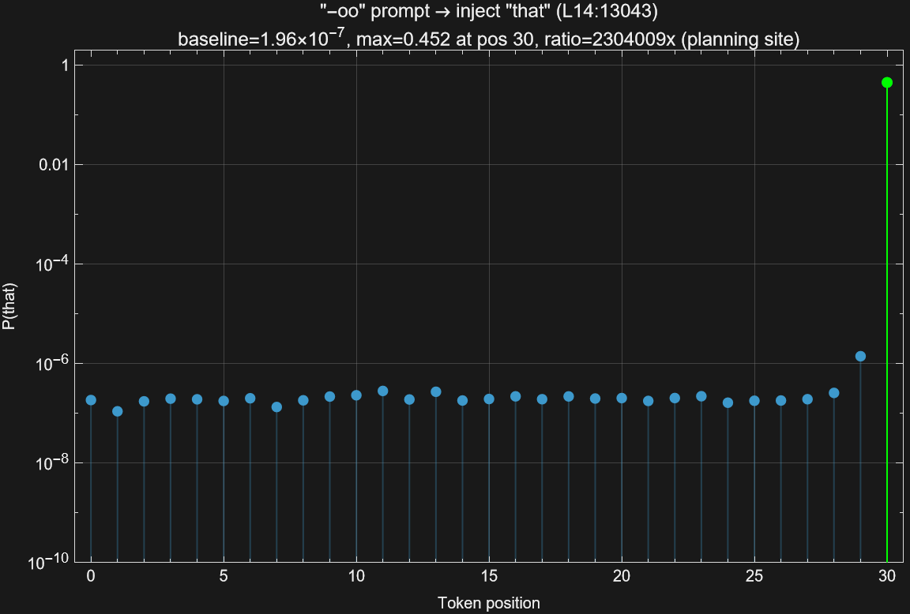
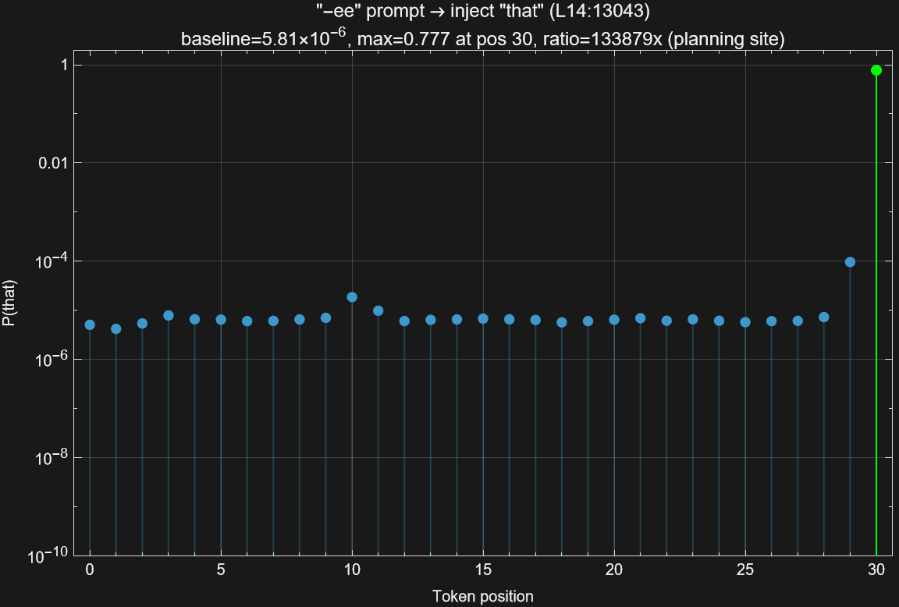
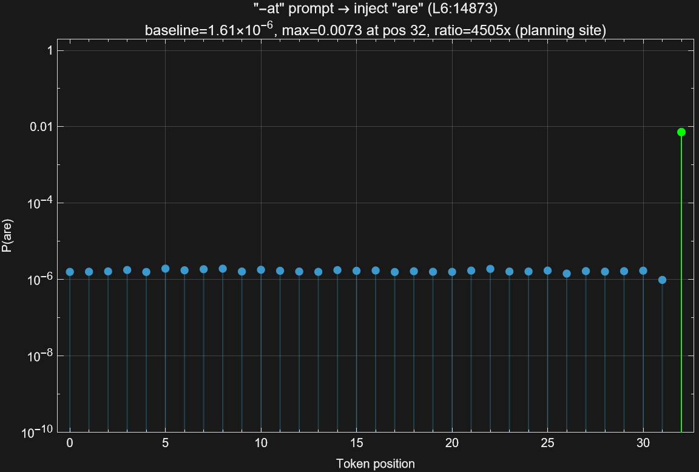
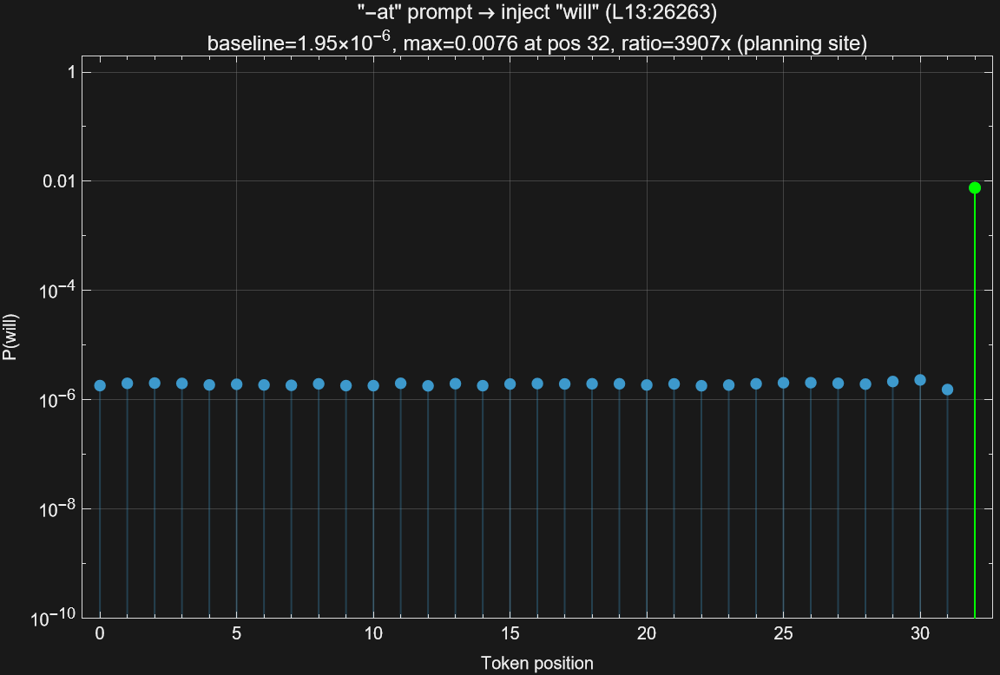
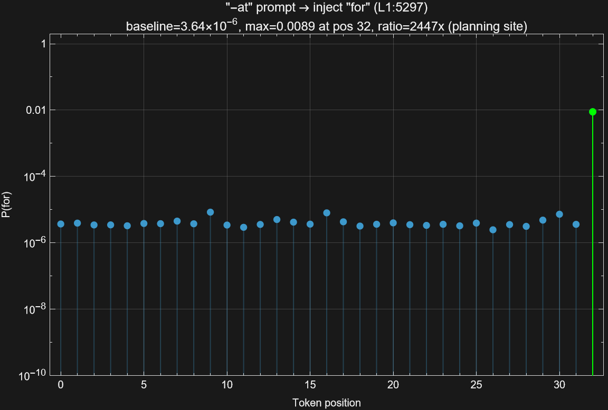

# 5. Llama 3.2 1B CLT Analysis and Position Sweep

**Author:** Eric Jacopin

**Model:** Llama 3.2 1B (`meta-llama/Llama-3.2-1B`, 16 layers, 2048 hidden, 128k vocab, tied embeddings)

**CLT:** [`mntss/clt-llama-3.2-1b-524k`](https://huggingface.co/mntss/clt-llama-3.2-1b-524k) (32,768 features/layer, 524k total)

**Hardware:** RTX 5060 Ti 16 GB, CUDA

This document covers Phase 6 of the planning circuit hunt: applying CLT
feature analysis and the suppress + inject position sweep to Llama 3.2 1B.
The goal is to test whether Llama's phonological circuit has the same
structure as Gemma's, and to produce the Figure 13 analogue for the
second model.

---

## 5.1 CLT feature layer mapping

**Experiment:** `examples/couplet_clt_circuit.rs` with `--model meta-llama/Llama-3.2-1B`

**Output:** `outputs/couplet_clt_circuit_llama.json`

Same protocol as Phase 2: for each couplet, identify the top-20 planning
features at the newline position via cosine similarity between CLT decoder
vectors and the target rhyme word embedding. Record the source layer
(where the CLT encoder reads) for each feature.

### Source layer distribution

| Layer | Count |
|-------|-------|
| L0    | 32    |
| L1    | 2     |
| L3    | 1     |
| L6    | 1     |
| **L15** | **164** |

**82% of all planning features originate at L15** -- the very last layer
before the output projection.

Compare to Gemma 2 2B, where planning features are distributed across
L0-L25 with a bimodal dumbbell shape: 48.5% at L0-L1 (search circuitry),
13.5% spread across mid layers, and 38% at L24-L25 (selection circuitry).
In Llama, the distribution is not bimodal -- it is a sharp spike at the
output boundary. The phonological circuit exists but is crammed into a
single layer.

### Feature overlap

Average Jaccard similarity across all couplet pairs: **0.24** (identical
to Gemma 2 2B's 0.24 from Phase 6a). This confirms a **general
phonological circuit** shared across couplets, not pair-specific
memorization. The rhyme features form a reusable module, regardless of
the specific rhyme ending.

---

## 5.2 Decoder-to-vocabulary projection

**Experiment:** `examples/couplet_clt_decoder_vocab.rs` with `--model meta-llama/Llama-3.2-1B`

**Output:** `outputs/couplet_clt_decoder_vocab_llama.json`

Same protocol as Phase 2b: project each feature's decoder vector through
the unembedding matrix (logit lens on the decoder vector itself) to see
which vocabulary words each feature pushes toward. Check how many of the
top-50 predictions fall within the target rhyme family.

### Per-couplet results

| Couplet | Target | Features with hits | Distinct candidates | Candidates |
|---------|--------|--------------------|---------------------|------------|
| 1       | light  | 8/20               | 4                   | bite, light, might, right |
| 2       | play   | 5/20               | 3                   | day, pay, play |
| 3       | sound  | 1/20               | 1                   | round |
| 4       | rain   | 4/20               | 1                   | rain |
| 6       | air    | 5/20               | 2                   | air, pair |
| 7       | gold   | 6/20               | 5                   | bold, fold, gold, old, sold |
| 8       | fire   | 4/20               | 1                   | fire |
| 13      | truth  | 1/20               | 1                   | truth |
| 14      | world  | 1/20               | 1                   | world |
| 15      | earth  | 3/20               | 2                   | birth, earth |

**Averages:** 3.8/20 features with rhyme hits (19%), 2.1 distinct
candidates per couplet.

### Comparison with Gemma 2 2B

In Gemma, the average was 4.6/20 features with hits (23%), and the
multi-candidate tier (play with 7 candidates, light with 3, air with 3)
showed clear spreading activation across the phonological neighborhood.
Llama's signal is weaker and noisier. Most features' top decoder
projections are sub-word tokens rather than clean English rhyme words.

The gold couplet is a notable exception: Llama produces 5 distinct
candidates (bold, fold, gold, old, sold) where Gemma produced 0/20. This
suggests that individual rhyme families may be encoded differently across
architectures, even when the aggregate statistics favor one model.

---

## 5.3 Vocabulary exploration

**Experiment:** `examples/poetry_category_steering.rs` with `--mode explore-vocabulary`

**Output:** `outputs/explore_vocab_llama.json`, `outputs/rhyme_pairs_llama.json`

Full scan of all 524K CLT features against the vocabulary (cosine
threshold >= 0.3), cross-referenced with the CMU Pronouncing Dictionary
to identify rhyme groups.

| Metric | Llama 3.2 1B | Gemma 2 2B |
|--------|-------------|------------|
| Words above threshold | 78 | 279 |
| Rhyme groups | 12 | 35 |
| Rhyming words | 28 | 98 |

Llama has **3.5x fewer** usable rhyme features than Gemma. The rhyme
groups that do exist are dominated by function words: he/be/we (IY1),
for/or/more (AO1 R), to/new (UW1), that/sat (AE1 T). Gemma's CLT
contained rich content-word rhyme groups (green/seen/keen,
rabbit/habit, know/show/flow) that support meaningful
suppress + inject experiments. Llama's vocabulary is sparser, limiting
the diversity of alternative injections.

---

## 5.4 Suppress + inject sweep (Figure 13 analogue)

**Experiment:** `examples/suppress_inject_sweep.rs` with `--model meta-llama/Llama-3.2-1B`

**Output:** `outputs/suppress_inject_sweep_llama_v2.json`

Same protocol as the Anthropic Figure 13 replication: suppress all
features from the natural rhyme group (negative strength across all
downstream layers) and inject a single feature from an alternative group
(positive strength across all downstream layers). Sweep the injection
position across all tokens and measure P(inject word).

**Prompts:** Llama-specific quatrains loaded from
`corpus/llama_prompts.json`, with rhyme groups matching the model's
available CLT vocabulary (IY1, AO1 R, UW1, AE1 T). Four prompts x 11
alternative groups = 44 experiment pairs.

### Top results

| Prompt | Inject word | Source | Max P | Ratio | Max pos |
|--------|-------------|--------|-------|-------|---------|
| -oo    | that        | L14    | 0.452 | 2,304,009x | last (30) |
| -ee    | that        | L14    | 0.777 | 133,879x   | last (30) |
| -ore   | that        | L14    | 0.320 | 106,081x   | last (31) |
| -at    | are         | L6     | 0.007 | 4,505x     | last (32) |
| -at    | will        | L13    | 0.008 | 3,907x     | last (32) |
| -at    | for         | L1     | 0.009 | 2,447x     | last (32) |

**Every strong injection peaks at the LAST token position.**

The `that` feature (L14:13043) is consistently the strongest injector --
a high-frequency function word with a powerful CLT feature. Even these
massive effects (P reaching 0.777 for "that") happen exclusively at the
last position.

### Position sweep figures

The per-position sweep produces the same shape as the Gemma
Figure 13 replication: flat baseline across all token positions, sharp
spike at the last token (the planning site).












### What the position sweep shows -- and does not show

**What it shows:** Llama's CLT features are causally effective. Injecting
an alternative rhyme feature at the last position can push P(inject word)
from ~10^-6 to 0.78. The phonological circuit exists and works.

**What it does not show:** Whether the model commits to a rhyme plan at
earlier positions during normal (un-steered) processing. The position
sweep is an external intervention applied at each position in turn. The
last-position spike confirms that features *can* steer predictions, but
this pattern is shared with Gemma -- it does not differentiate the two
models.

**Important nuance:** This pattern also holds for Gemma 2 2B. The Gemma
position sweep figures (see `docs/planning-in-poems/figures/`) show
the same shape -- flat baseline, spike at the last token. The position
sweep is therefore a necessary but not sufficient test: it confirms
functional features but does not by itself reveal temporal planning
differences. The distinguishing evidence comes from other experiments:

- **Phase 1 (logit lens):** Rhyme words appear in Gemma's intermediate
  layer predictions (L14-22) but not in Llama's.
- **Phase 4b (cross-model logit lens):** The rhyme signal persists
  across layers in Gemma but dissipates in Llama.
- **Phase 5 (layer suppression):** Skipping L22-25 in Gemma destroys
  rhyming (0/10), proving those layers are causally necessary.
- **Phase 6a (CLT mapping):** Llama's planning features are crammed
  into L15 (82%), whereas Gemma's are distributed across L0-L25.

---

## 5.5 Summary: Llama vs. Gemma CLT comparison

| Metric | Llama 3.2 1B | Gemma 2 2B |
|--------|-------------|------------|
| CLT features/layer | 32,768 | 16,384 |
| Total CLT features | 524k | 426k |
| Planning feature concentration | 82% at L15 (last layer) | Bimodal: L0 (48%) + L24-25 (38%) |
| Feature overlap (Jaccard) | 0.24 | 0.24 |
| Rhyme-relevant features | 19% (3.8/20) | 23% (4.6/20) |
| Vocabulary rhyme groups | 12 | 35 |
| Usable rhyming words | 28 | 98 |
| Best suppress+inject P | 0.777 ("that") | 0.483 ("around") |
| Position sweep shape | Spike at last pos | Spike at last pos |

Despite having more total CLT features (524k vs. 426k), Llama's
phonological circuit is structurally impoverished: 3.5x fewer usable
rhyme features, nearly all planning features concentrated at a single
layer, and weak decoder-to-vocabulary projections. The features *work*
when externally injected (high absolute P values) but lack the
distributed multi-layer architecture that supports Gemma's commitment
mechanism.

**Note:** The Gemma column above uses the 426K CLT (group-level features).
A [2.5M CLT upgrade](../planning-in-poems/04-2.5M-word-level.md) on the
melomētis branch provides word-level resolution for Gemma (209 words, 67
rhyme groups, 52.2% best redirect). No equivalent high-resolution CLT
exists for Llama 3.2 1B at present.

---

## 5.6 Updated conclusion (Phases 1-6)

The complete investigation now spans six phases across two models,
combining correlational and causal evidence from logit lens, CLT feature
analysis, layer suppression, and CLT steering.

### Evidence table

| Evidence type | Source | Finding |
|---|---|---|
| Correlational | Phase 1 (logit lens) | Rhyme words appear at L14-22, persist to L25 in Gemma |
| Correlational | Phase 4b (cross-model logit lens) | Signal persists in Gemma, dissipates in Llama |
| **Causal** | **Phase 5 (layer suppression)** | **L22-25 are necessary for rhyming (0/10 without them)** |
| Correlational | Phase 6a (CLT mapping) | Llama planning features crammed into L15 (82%) |
| Correlational | Phase 6b (decoder-to-vocab) | Llama features: only 19% rhyme-relevant (weak fidelity) |
| **Causal** | **Phase 6d (position sweep)** | **CLT features are functional in both models (spike at last pos)** |

### The circuit-level picture

**Gemma 2 2B (26 layers):** Three circuit populations spread across the
full depth -- search (L0), planning register (L10-22), commitment
(L22-25). The logit lens (Phase 1) shows rhyme words appearing in
intermediate-layer predictions at the newline position, and layer
suppression (Phase 5) confirms L22-25 are causally necessary for
rhyming.

**Llama 3.2 1B (16 layers):** The phonological circuit exists but is
compressed into L15 (the last layer). Features have the same general
structure (shared across couplets, Jaccard 0.24) but weak word-level
specificity (19% vs. higher in Gemma). The logit lens (Phase 4b) shows
the rhyme signal dissipating rather than persisting across layers.

**Both models:** The position sweep (Phase 6d) shows that CLT features
are causally effective in both -- injecting at the last position
redirects predictions with massive ratios (up to 2.3Mx in Llama, up to
10^8x in Gemma). This confirms the features work, but the last-position
spike pattern is shared, not distinguishing.

### What separates planning from selection

The decisive difference is not whether phonological features exist (they
do in both models), nor whether they can steer predictions when
externally injected (they can in both). The difference is whether the
model **internally** activates planning representations at intermediate
positions during normal processing:

- **Logit lens evidence (Phases 1, 4b):** In Gemma, the target rhyme
  word appears in top-k predictions at the newline position starting at
  L14 and persists to L25. In Llama, the signal is absent or transient.
- **Layer necessity (Phase 5):** Skipping Gemma's L22-25 destroys
  rhyming completely (0/10), proving these layers implement the
  commitment step.
- **Feature distribution (Phase 6a):** Gemma's planning features are
  distributed across L0-L25, consistent with a multi-stage circuit.
  Llama's are 82% concentrated at L15, leaving no room for an
  intermediate planning register.

---

## Reproduction

All Phase 6 experiments can be reproduced with:

```bash
# 6a: CLT circuit mapping (Llama)
cargo run --release --example couplet_clt_circuit -- \
    --model meta-llama/Llama-3.2-1B \
    --clt mntss/clt-llama-3.2-1b-524k \
    --output outputs/couplet_clt_circuit_llama.json

# 6b: Decoder-to-vocabulary projection (Llama)
cargo run --release --example couplet_clt_decoder_vocab -- \
    --model meta-llama/Llama-3.2-1B \
    --clt mntss/clt-llama-3.2-1b-524k \
    --output outputs/couplet_clt_decoder_vocab_llama.json

# 6c: Vocabulary exploration (all 16 layers, full scan)
cargo run --release --example poetry_category_steering -- \
    --mode explore-vocabulary \
    --model meta-llama/Llama-3.2-1B \
    --clt-repo mntss/clt-llama-3.2-1b-524k \
    --sample-step 1 \
    --layers 0,1,2,3,4,5,6,7,8,9,10,11,12,13,14,15 \
    --output outputs/explore_vocab_llama.json

# 6c: Find rhyme pairs via CMU dictionary
cargo run --release --example poetry_category_steering -- \
    --mode find-rhyme-pairs \
    --explore-json outputs/explore_vocab_llama.json \
    --cmu-dict corpus/cmudict.dict \
    --min-cosine 0.3 \
    --output outputs/rhyme_pairs_llama.json

# 6d: Suppress + inject sweep (Llama-specific prompts)
cargo run --release --example suppress_inject_sweep -- \
    --model meta-llama/Llama-3.2-1B \
    --clt-repo mntss/clt-llama-3.2-1b-524k \
    --rhyme-pairs outputs/rhyme_pairs_llama.json \
    --prompts corpus/llama_prompts.json \
    --output outputs/suppress_inject_sweep_llama_v2.json
```

Results are written to the `outputs/` directory as JSON files.
Position sweep figures are in `docs/planning-circuit-hunt/figures/`.
Mathematica data export: `scripts/llama_position_sweep_data.wl`.
