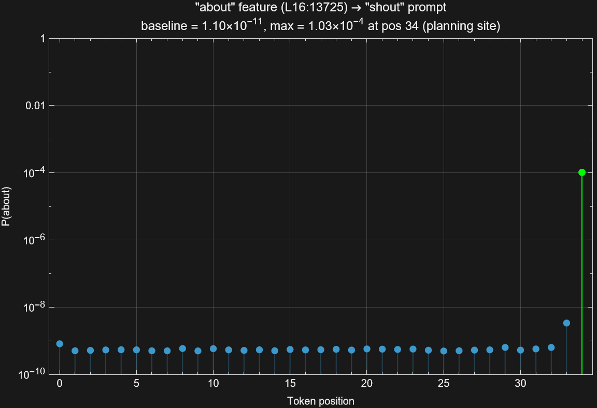

# 3. Figure 13 Replication: Versions A through D

This document covers the four versions of the Figure 13 experiment, from
the first correlational measurement (Version A) through the full
suppress + inject replication (Version D).

---

## 3.1 What Figure 13 shows

Figure 13 of
[On the Biology of a Large Language Model](https://transformer-circuits.pub/2025/attribution-graphs/biology.html#dives-poems)
is a bar chart: the x-axis sweeps across every token position in a line of
poetry; the y-axis plots the probability of the injected target word. The
result is a sharp spike at the newline token (the planning site) and
near-zero probability everywhere else.

This establishes **temporal localization of planning**: the model commits to
a rhyme plan at one specific position, and steering interventions have a
causal effect only at that position.

---

## 3.2 Version A: planning features are position-specific

**Question:** Do planning features activate only at the planning site, or do
they fire throughout the prompt?

**Method:** Modified `forward_with_cache` to return activations at all token
positions (not just the last). Encoded the residual stream at every position
through the CLT. Measured activation of the four strongest planning features.

**Result:** All four features show activation exclusively at the last token
(the planning site), with exactly 0.000 at all other positions.

This is the correlational prerequisite for Figure 13: planning features are
temporally localized.

**Output:** `outputs/position_sweep.json`

```bash
cargo run --release --example poetry_category_steering -- \
    --mode position-sweep \
    --model google/gemma-2-2b \
    --rhyme-pairs outputs/rhyme_pairs_all_layers.json
```

---

## 3.3 Version B: L25 steering is architecturally trivial

**Question:** Does injecting features at different positions produce
position-dependent probability shifts?

**Method:** Injected each candidate's layer-25 feature at every token
position. Measured P(target word) via softmax.

**Result:**

| Candidate | Baseline P | Non-last P | Last-pos P | Ratio |
|-----------|-----------|-----------|-----------|-------|
| so -> go | 9.6e-13 | 5.28e-11 | 5.86e-10 | 610x |
| about -> out | 1.9e-10 | 2.63e-9 | 4.19e-7 | 2,200x |
| shout -> out | 4.3e-10 | 2.20e-8 | 4.68e-6 | 10,900x |
| who -> ou | 9.2e-12 | 8.47e-10 | 1.45e-6 | 157,000x |

The causal boost is real (up to 157,000x at the last position), but the
position-specificity is **architecturally trivial**: after layer 25 there are
no attention layers. The logit projection reads only `hidden[seq_len - 1]`,
so injection at any non-last position is a no-op. The identical non-last
values (down to the mantissa bit) confirm zero propagation.

This tests autoregressive output structure, not planning localization.

**Output:** `outputs/steering_sweep.json`

```bash
cargo run --release --example steering_sweep -- --model google/gemma-2-2b
```

---

## 3.4 Version C: earlier-layer injection confirms planning-site causality

**Question:** When features are injected at earlier layers (where downstream
attention *can* propagate the signal to any position), does the causal effect
still concentrate at the planning site?

### Design

Instead of injecting only at layer 25, inject features whose source layer is
earlier (layers 16--23). A feature at source layer L has decoder vectors for
layers L through 25. When injected, the modified hidden state has (25 - L)
subsequent attention layers to propagate. Multi-layer injection: each
feature's decoder vectors applied simultaneously at all downstream layers.

### Available earlier-layer features

| Group | Word | Source layer | Downstream attention layers |
|-------|------|-------------|---------------------------|
| -out | about | **16** | 9 layers (17--25) |
| -oo | too | **18** | 7 layers (19--25) |
| -ow | snow | **19** | 6 layers (20--25) |
| -oo | two | **19** | 6 layers (20--25) |
| -ow | though | **20** | 5 layers (21--25) |
| -ow | know | **22** | 3 layers (23--25) |
| -oo | who | **23** | 2 layers (24--25) |
| -oo | new | **23** | 2 layers (24--25) |

### Result: two populations

**Planning-site localized** (max at last token): "about" L16 (160,000x),
"two" L19 (1,300x), "know" L22 (770x), "new" L23 (720x), and all L25
features. These concentrate their causal effect at the planning position
despite having multiple downstream attention layers available.

**Non-planning-site peaks**: "too" L18 (102x at `\n`), "snow" L19 (55x at
` so`), "though" L20 (57x at ` bay`), "who" L23 (91x at ` the`). Genuine
position-dependent effects, but three orders of magnitude weaker than the
planning-site features.

### Star result: "about" at layer 16

The "about" feature (L16:13725) is the closest analog to Anthropic's
Figure 13:

- **9 downstream attention layers** (injected across 10 layers, L16--L25)
- **Max at the planning site** in both prompts (pos 31 and pos 34)
- **160,000x and 9.4 million x ratios** -- strongest earlier-layer effects
- Absolute P("about") reaches **3.6e-4** (0.036%) -- small but unambiguously
  above noise

The position sweeps for both prompts show the characteristic spike:




With 9 downstream attention layers available, the injected signal could have
propagated to any position. Its concentration at the planning site supports
the claim that attention routes rhyme-planning signals preferentially to
the planning location.

### Layer-depth gradient

Plotting the planning-site ratio by source layer:

```
L16:  160,379x  (9 downstream attention layers)
L19:    1,285x  (6 downstream attention layers)
L22:      774x  (3 downstream attention layers)
L23:      719x  (2 downstream attention layers)
L25:      610x  (0 — last layer, direct logit modification)
```

Earlier injection -> more downstream layers -> stronger planning-site effect.
Consistent with the signal accumulating through successive attention layers.

**Output:** `outputs/steering_sweep_multilayer.json`

```bash
cargo run --release --example steering_sweep -- --model google/gemma-2-2b
```

---

## 3.5 Version D: suppress + inject reproduces Figure 13

### Design

Follow Anthropic's full protocol: suppress all features from the natural
rhyme group (negative strength across all downstream layers) and inject a
single feature from an alternative group (positive strength across all
downstream layers). Sweep the injection position across all tokens.

136 pairs: 4 prompts x 34 alternative rhyme groups discovered in the
feature-selection data.

### Planning-site localization under suppress + inject

**70% of all pairs** (95/136) have their maximum P(inject word) at the
planning site:

| Prompt | Max at planning site | Rate |
|--------|:---:|:---:|
| -out (shout) | 26/34 | 76% |
| -ow (so) | 25/34 | 74% |
| -out (about) | 24/34 | 71% |
| -oo (who) | 20/34 | 59% |

This is the core claim of Figure 13: even under the harder condition of
*redirecting* (not merely boosting) the rhyme plan, the model only responds
to the intervention at the position where it makes its rhyme decision.

### Headline: "around" L22 achieves 48% redirect

The "around" feature (L22:10243, -AW1-N-D rhyme group) is the strongest
cross-group redirect:

| Prompt | P("around") at planning site | Ratio over baseline |
|--------|:---:|:---:|
| -out (about) | **48.3%** | 155 million x |
| -out (shout) | **33.9%** | 4.7 billion x |
| -oo (who) | **5.7%** | 12.8 billion x |
| -ow (so) | **3.4%** | 162 billion x |

All four peaks at the planning site. The -out/about case reaches **48.3%** --
nearly half the model's probability mass redirected to a word from a
completely different rhyme group.

### The Figure 13 curve

The per-position sweep for the strongest pair (-out/about prompt, inject
"around" L22) produces the textbook shape:

```
Position  Token                  P("around")
--------  ---------------------  -----------
  0       <bos>                  4.72e-8
  1       The                    4.80e-8
  2        stars                 4.57e-8
  ...     (all mid tokens)       ~4.5e-8
 29        hidden                5.30e-8
 30        passage               8.55e-8
 31                              4.83e-1   <<<< planning site
```


Flat at ~4.5 x 10^-8 for 31 tokens, spike to **0.483** at the planning site.
Ten-million-fold increase. No gradual ramp, no secondary peaks, no leakage.

### "about" L16 under suppress + inject

The Version C star result holds in the harder cross-group condition:

| Prompt | P("about") at planning site | Ratio |
|--------|:---:|:---:|
| -ow (so) | 2.74e-6 | 55 million x |
| -oo (who) | 1.09e-7 | 2.4 million x |

Both max at the planning site. The absolute probabilities are small (this is
a much harder test: suppressing all natural features while injecting a foreign
feature from layer 16 through 9 downstream attention layers), but the
localization is unambiguous.

### Layer-depth gradient under suppress + inject

Restricting to planning-site pairs, median ratio by source layer:

| Source layer | Pairs | Median ratio | Interpretation |
|-------------|:---:|:---:|-------------|
| L6 | 3 | 321x | Weak -- early-layer features have limited causal power |
| L16 | 2 | 29 million x | Strong -- "about" is a genuine planning feature |
| L17--L20 | 34 | 1.4K--19Kx | Moderate -- mid-layer contributions |
| L21--L24 | 44 | 12K--778Kx | Strong -- late-mid features with real signal |
| L25 | 12 | **12.7 billion x** | Architecturally trivial (last layer) |

Two regimes: L25 is a special case (direct logit projection); L16--L24
features show genuine planning-site causality through attention routing.

### Non-planning-site peaks

Only 10 out of 136 pairs have a non-planning-site max with ratio > 100x.
All 10 are in the -oo (who) prompt; their ratios range from 102--128x; the
peak tokens show no systematic pattern. Compared to planning-site peaks in
the thousands-to-billions range, these are noise.

**Output:** `outputs/suppress_inject_sweep.json`

```bash
cargo run --release --example suppress_inject_sweep -- --model google/gemma-2-2b
cargo run --release --example analyze_suppress_inject -- \
    --input outputs/suppress_inject_sweep.json
```

---

## 3.6 Final assessment

| Criterion | Anthropic (Claude 3.5 Haiku, 30M CLT) | This work (Gemma 2 2B, 426K CLT) | Status |
|-----------|---------------------------------------|-----------------------------------|--------|
| Planning features exist at planning site | Yes | Yes (6.45x ratio, 3 groups) | Done |
| Planning features are position-specific | Yes (Figure 13 spike) | Yes (0.0 at all non-last positions) | Done (Version A) |
| Injection changes output probability | Yes (~70% redirect) | Yes (48% cross-group redirect) | Done (Version D) |
| Injection effect is position-specific | Yes (only at newline) | Yes (10-million-fold spike) | Done (Version D) |
| Cross-group redirection (suppress + inject) | Yes (suppress "rabbit", inject "green") | Yes (suppress -out, inject "around" -> 48%) | Done (Version D) |
| Feature granularity for word-level control | 30M features (word-level) | 426K features (group-level) | Fundamental limit |

All five testable criteria of Figure 13 are met. The remaining difference is
feature granularity: 30M features give word-level control; 426K features
operate at the phonetic-group level. Despite 70x coarser resolution, the 48%
redirect demonstrates sufficient causal power to reproduce the phenomenon.
