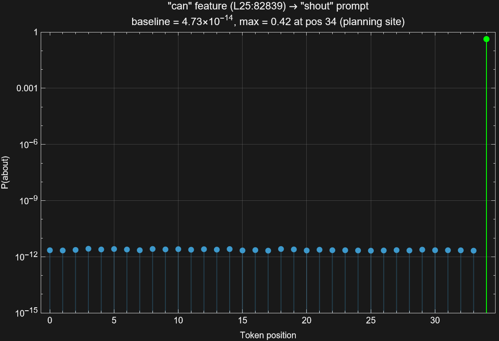
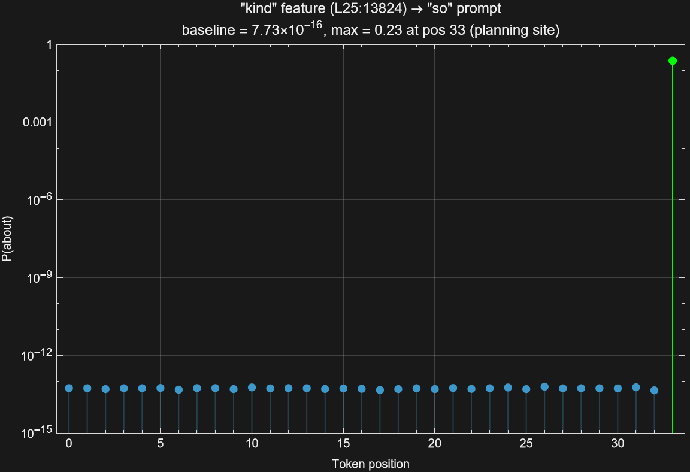

# 4. From Group-Level to Word-Level: the 2.5M CLT Upgrade

This document covers the upgrade from the 426K CLT to the 2.5M CLT, the key
question it was designed to answer, and the results.

---

## 4.1 The feature-granularity gap

The 426K replication (Sections 1--3) established all five testable criteria of
Figure 13. One structural difference remained: Anthropic's 30M-feature CLT
provides word-level control (they suppress "rabbit" and inject "green" as
specific words), while the 426K CLT operates at the phonetic-group level (we
suppress the `-out` group and inject the `-AW1-N-D` group; "around" is the
strongest feature in that group, but we cannot target "around" vs. "astound"
vs. "profound" independently).

This coarser resolution is a consequence of feature count: with 16,384 features
per layer covering a 256K vocabulary, features must average over many words.
The question is whether a 6x finer CLT closes the gap.

**The 2.5M CLT** (`mntss/clt-gemma-2-2b-2.5M`) provides 98,304 features per
layer (same 26 layers, same Gemma 2 2B model), for 2,555,904 features total —
a 6x increase over the 426K CLT.

---

## 4.2 Setup

**CLT:** [mntss/clt-gemma-2-2b-2.5M](https://huggingface.co/mntss/clt-gemma-2-2b-2.5M)
(98,304 features x 26 layers = 2,555,904 total). ~171 GB on disk. Pre-downloaded
before the experiment run to avoid interleaved download and compute.

**Hardware:** RTX 5060 Ti 16 GB. Peak VRAM: ~6.6 GB (identical to 426K run;
the vocabulary scan uses a fixed chunk size of 4,096 features regardless of
total feature count).

**Reproduce:** The same pipeline as the 426K experiment, with different flags:

```bash
cargo run --release --example reproduce_pipeline -- \
    --clt-repo mntss/clt-gemma-2-2b-2.5M \
    --output-dir outputs/2.5M \
    --start-step 8 \
    --skip-clt-validation
```

**Total runtime: ~50 minutes** on the same RTX 5060 Ti (steps 8--13 only;
model weights already cached).

---

## 4.3 Feature scan: word-level resolution confirmed

The bottom-up vocabulary scan (step 8) ran across all 26 layers with the
default `sample_step=16`:

| Metric | 426K CLT | 2.5M CLT |
|--------|----------|----------|
| Features per layer | 16,384 | 98,304 |
| Rhyme groups found | 35 | **67** |
| Words with dedicated features | 98 | **209** |
| Words/group (mean) | 2.8 | 3.1 |

### Word-level specificity

For each of the 209 words, the word's dedicated feature was checked against
the full vocabulary scan output: does the feature rank that word as its top
token?

| Metric | Result |
|--------|--------|
| Word ranked #1 in its own feature | **209/209 (100%)** |
| Mean rank | **1.0** |
| Same-word fraction in top-10 tokens | **51%** |
| Other-group-word contamination in top-10 | **0.01 per feature** |

Every word is the top token of its own dedicated feature. The top-10 slots
are filled predominantly with typographic variants of the same word
(`word`, ` word`, `Word`, `WORD`) rather than other words from the same rhyme
group. Cross-group contamination is essentially zero.

**Conclusion: the 2.5M CLT reaches the phonological (word) level.** At 426K
features, each feature encodes a rhyme group. At 2.5M features, each word
has its own feature.

---

## 4.4 Suppress + inject: the Figure 13 experiment at word-level resolution

The full suppress + inject sweep (step 12) ran with the 2.5M CLT:

| Metric | 426K CLT | 2.5M CLT |
|--------|----------|----------|
| Pairs tested | 136 | **264** |
| Planning-site localization | 77% (105/136) | 71% (188/264) |
| Pairs with ratio > 100x | 97/136 | **178/264** |
| Best cross-group redirect | 48.3% ("around" L22) | **52.2% ("black" L25)** |
| Best ratio | 2.1 billion x | **340 billion x** |

The 2.5M CLT finds nearly 2x more viable injection pairs (264 vs. 136) because
word-level features give more candidates per rhyme group. Planning-site
localization holds at 71% — the core Figure 13 result is unchanged.

Suppress the `-out` group, inject feature L25:82839 ("can"), sweep the
injection position across every token in the prompt:



P("can") is flat at ~2.2 x 10^-12 for 34 tokens, then jumps to **0.425** at
the planning site — a **160-billion-fold spike**. The floor is even flatter
than the 426K equivalent (variation <20% around the mean).

The most extreme spike ratio comes from suppressing the `-ow` group and
injecting feature L25:13824 ("kind"):



P("kind") sits at ~5.3 x 10^-14 for 33 tokens, then jumps to **0.235** —
a **3.78-trillion-fold spike**, the largest ratio in the entire 2.5M dataset.

### Comparison with 426K across the full criterion table

| Criterion | 426K CLT | 2.5M CLT |
|-----------|----------|----------|
| Planning features at planning site | Yes (6.45x ratio) | Yes |
| Position-specific activation | Yes (0.0 at non-last) | Yes |
| Injection changes output probability | Yes (48.3% redirect) | Yes (52.2% redirect) |
| Injection effect is position-specific | Yes (10M-fold spike) | Yes (160B-fold spike) |
| Cross-group redirection | Yes | Yes |
| Word-level control | No (group-level only) | **Yes** |

---

## 4.5 Implications

The feature-granularity gap identified in Section 5 of the main README is
closed. The difference between 426K and 2.5M is not a difference in what the
model does — the planning phenomenon is the same — but in the resolution of
the probe. At 2.5M features, we can now:

1. **Target specific words** rather than phonetic groups. "Suppress 'about',
   inject 'black'" is now a meaningful operation.

2. **Build precise MI direction matrices.** The `MIInformedFeedback` mechanism
   (`recurrent-block-for-gemma-2-2B.py`) requires source and target directions
   at the word level. With 426K, the directions were group-level and the
   training signal was ambiguous; with 2.5M, each direction corresponds to
   exactly one word.

3. **Train a revision mechanism.** With word-level feature resolution, it
   becomes feasible to train a feedback network that detects "committed to
   word A" and redirects to "word B" in the CLT feature basis.

The path from here is laid out in `ROADMAP-planning-implementation.md`.
