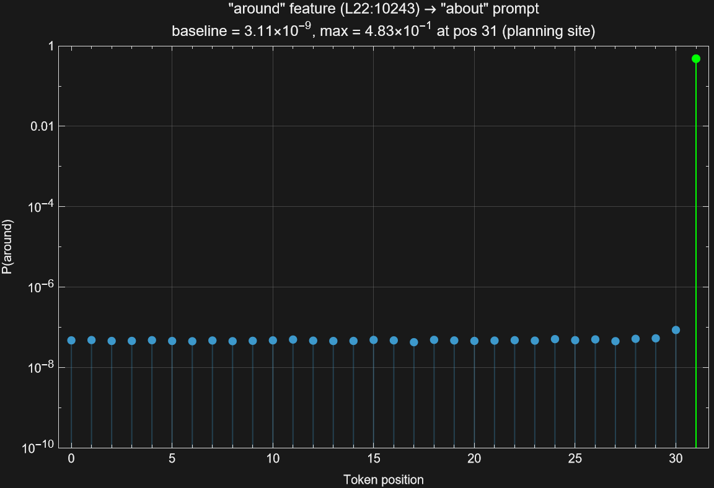
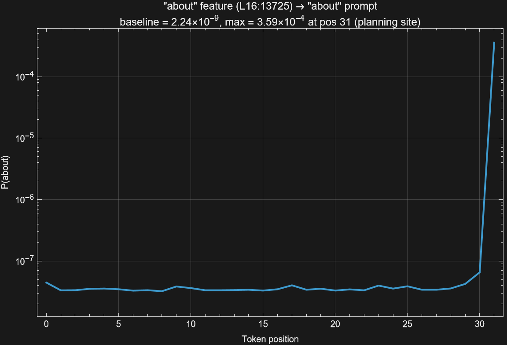

# Replicating "Planning in Poems" with Open Tools

*Melomētis (μέλος + μῆτις) — "song's cunning intelligence"*

**Author:** Eric Jacopin

My background is AI Planning — hierarchical task networks, goal decomposition,
the classical tradition. When Anthropic reported that Claude 3.5 Haiku performs
internal "planning" during poem generation, the natural question from that field
is: how far does the analogy go? Can we relate what an LLM does at the newline
token to anything recognizable as planning in the classical sense? Answering
that question requires having something reproducible to test. This project
builds that test bench.

---

**Contents:**
[1. The result](#1-the-result) |
[2. Setup](#2-setup) |
[3. The journey](#3-the-journey) |
[4. How to reproduce](#4-how-to-reproduce) |
[5. What we did not replicate](#5-what-we-did-not-replicate) |
[6. File inventory](#6-file-inventory) |
[7. Acknowledgments](#7-acknowledgments)

---

Anthropic reported that Claude 3.5 Haiku plans ahead when writing rhyming
poetry: at the newline token between lines,
[Cross-Layer Transcoder](https://transformer-circuits.pub/2025/attribution-graphs/biology.html)
(CLT) features for candidate rhyme
words pre-activate before any token of the next line is generated. Suppressing
the natural plan and injecting an alternative redirects the line ending.
The strongest evidence is Figure 13 of
[On the Biology of a Large Language Model](https://transformer-circuits.pub/2025/attribution-graphs/biology.html#dives-poems)
(Lindsey et al., 2025) -- a position sweep showing that the intervention
has a causal effect *only* at the planning site.

This branch replicates that core finding using entirely open components:

| Component | Anthropic | This work |
|-----------|-----------|-----------|
| Model | Claude 3.5 Haiku (proprietary) | Gemma 2 2B (open-weights, 2.6B params) |
| CLT | 30M features (internal) | 426K features ([mntss/clt-gemma-2-2b-426k](https://huggingface.co/mntss/clt-gemma-2-2b-426k)) |
| Toolkit | Internal infrastructure | Rust + [candle](https://github.com/huggingface/candle) (PLIP-rs) |
| Hardware | (unspecified) | RTX 5060 Ti 16 GB (single consumer GPU) |
| New code | -- | ~3,200 lines (`src/clt.rs` + `src/forward_gemma2.rs`) |

---

## 1. The result

Suppress all features from the natural rhyme group (`-out`), inject a single
feature from an alternative group (`-AW1-N-D`, the word "around", layer 22),
and sweep the injection position across every token in the prompt:

```
Position  Token                  P("around")
--------  ---------------------  -----------
  0       <bos>                  4.72e-8
  1       The                    4.80e-8
  2        stars                 4.57e-8
  3        were                  4.58e-8
  4        twinkling             4.77e-8
  5        in                    4.56e-8
  6        the                   4.49e-8
  7        night                 4.68e-8
  8       ,                      4.51e-8
  9       \n                     4.60e-8
 10       The                    4.72e-8
 11        lanterns              4.94e-8
 12        cast                  4.65e-8
 13        a                     4.55e-8
 14        golden                4.57e-8
 15        light                 4.84e-8
 16       .                      4.72e-8
 17       \n                     4.25e-8
 18       She                    4.86e-8
 19        wandered              4.70e-8
 20        in                    4.57e-8
 21        the                   4.66e-8
 22        dark                  4.77e-8
 23        about                 4.65e-8
 24       ,                      5.07e-8
 25       \n                     4.77e-8
 26       And                    4.99e-8
 27        found                 4.50e-8
 28        a                     5.15e-8
 29        hidden                5.30e-8
 30        passage               8.55e-8
 31                              4.83e-1   <<<< planning site
```



P("around") is flat at ~4.5 x 10^-8 for 31 tokens, then jumps to **0.483** at
the planning site -- a **ten-million-fold spike**. There is no gradual ramp, no
secondary peak, no leakage to adjacent positions. The model responds to the
intervention if and only if it is applied where it makes its rhyme decision.

This is the same shape Anthropic showed for "green" injection in Claude 3.5
Haiku. The model, the CLT, and the rhyme group are all different. The
phenomenon is the same.

The implication goes beyond replication. Anthropic's finding was demonstrated
on a single proprietary model; one could reasonably attribute the planning
behavior to their specific training pipeline. This work reproduces it in
Gemma 2 2B — a model from a different organization, trained on different data,
with a different alignment procedure, at a different scale, probed with a
different (and 70x coarser) CLT. The two models share essentially one thing:
the transformer architecture. This suggests that planning-site localization
is not a training artifact but an **architectural property of
attention-based models**.

**Output:** `outputs/suppress_inject_sweep.json`

**Script:** `cargo run --release --example suppress_inject_sweep`

**Analysis:** `cargo run --release --example analyze_suppress_inject -- --input outputs/suppress_inject_sweep.json`

---

## 2. Setup

**Model:** [google/gemma-2-2b](https://huggingface.co/google/gemma-2-2b)
(2.6B parameters, base, BF16). The base model cannot rhyme unprompted; a
priming couplet with a different rhyme ending is required (78% rhyme rate at
T=0 with priming, 0% without). All experiments use four-line completion prompts
with this structure.

**CLT:** [mntss/clt-gemma-2-2b-426k](https://huggingface.co/mntss/clt-gemma-2-2b-426k)
(16,384 features x 26 layers = 425,984 total features). Loaded lazily via
HuggingFace Hub; encoder shards streamed and freed to fit in 16 GB VRAM.
Validated against Python Circuit Tracer reference: 90/90 top-10 features match
(max relative error 1.2 x 10^-6).

**Corpus:** 780 poetry samples (260 rhyming, 260 non-rhyming, 260 generation
prompts) across 20 rhyme groups, generated from the CMU Pronouncing Dictionary.

**New code:**
- `src/clt.rs` (1,640 lines) -- CLT encoding, decoding, injection infrastructure
- `src/forward_gemma2.rs` (1,570 lines) -- Gemma 2 2B forward pass with
  softcapped attention, GQA, alternating local/global sliding window, and CLT
  injection hooks

---

## 3. The journey

The replication took four attempts (Versions A through D), preceded by a
detection phase and six failed steering methods. Each failure was informative.

### Detection: the planning signal exists but is sparse

Measured CLT feature activations at the planning site (the newline token after
line 3) for 24 completion-style prompts across 10 rhyme groups. Features
associated with the prompt's own rhyme group activate 6.45x more than features
from other groups. Three groups show strong signal (`-out`, `-oo`, `-ow`);
seven show zero activation. The signal requires priming context (ratio 0.87
without priming, 6.45 with priming).

An earlier observational design (A-vs-B attention comparison, rhyming vs.
non-rhyming completions) produced Cohen's d = 0.000 at every layer. The
conditions differ only *after* the measurement point, making them invisible
to a causal model's internal representations. This failure motivated the
pivot to interventional methods.

> Detail: [01-detection.md](01-detection.md)

### Methods 1--6: exact-word steering fails at 426K features

Six methods tried to force a specific word as the line ending by injecting CLT
features at the planning site. All produced **0% target hit rate**:

| Method | Strategy | Outcome |
|--------|----------|---------|
| 1 | Max-activation probes | 0% hit |
| 2a/b | Decoder dot-product / cosine | 0% hit; catastrophic degradation at high strength |
| 3 | Planning-site activation + cosine filter | 0% hit |
| 4 | Method 3 + multi-layer clamping | 0% hit |
| 5 | Contrastive word probes | 0% hit |
| 6 | Causal activation patching | Best effect: 9.72 logit units removed, still 0% hit |

**Root cause:** The logit gap between the model's natural top prediction and
any target word is ~25+ units. With 426K features split across 26 layers
(~16K per layer) covering a 256K vocabulary, no small group of features is
specific enough to act as a lexical selector. The features capture *semantic
neighborhoods*, not individual words.

**Turning point:** Method 6 proved that causally relevant features *do exist*
(ablating them drops the target logit by up to 9.72 units). The problem was
not feature quality but measurement: binary argmax is the wrong metric.
Anthropic measures continuous probability, not top-1 hit.

> Detail: [02-steering.md](02-steering.md)

### The pivot: reverse-engineering the CLT

Six top-down methods had failed because they assumed word-level feature
resolution that 426K features cannot provide. Rather than continuing to force
Anthropic's protocol onto different tools, the approach reversed: instead of
asking "which features steer toward word X?", ask "what do the CLT's decoder
vectors actually encode?"

Each feature's decoder vector was compared (cosine similarity, GPU matmul)
against all 256,768 token embeddings. Of 425,984 features scanned, 287 have a
clean English word as their top-cosine token. Cross-referencing with the CMU
Pronouncing Dictionary revealed that these features cluster by **phonetic
ending**: the feature for "found" also scores high on "ground", "round", and
"around" -- words sharing the `-ound` ending but no semantic relationship.
35 rhyme groups emerged, 10 of which were selected for all subsequent
experiments.

This answered the key question: at 426K features, the CLT encodes
**rhyme-group-level** structure, not word-level. Every experiment from this
point forward -- detection, steering, and the Figure 13 replication -- was
designed at this granularity.

> Detail: [01-detection.md](01-detection.md), Section 1.4

### Version A: planning features are position-specific

Measured feature activation at every token position (not just the last).
Four feature-prompt pairs (so→`go`, about→`out`, shout→`out`, who→`ou`)
show activation exclusively at the planning site, with exactly 0.000
at all other positions.

**Output:** `outputs/position_sweep.json`

### Version B: L25 steering is architecturally trivial

Injected L25 features at each position. Found 610x--157,000x boosts at the
planning site, but zero effect at all other positions -- down to the mantissa
bit. After layer 25, only the final norm + logit projection remain. There are
no attention layers to propagate the signal, so injection at any non-last
position is a no-op. This tests autoregressive output structure, not planning.

**Output:** `outputs/steering_sweep.json`

### Version C: earlier-layer injection confirms planning-site causality

Injected features from layers 16--23 (with 2--9 downstream attention layers
available for propagation). Multi-layer injection: each feature's decoder
vectors applied at the source layer through layer 25.

Result: the "about" feature at layer 16 (injected across 10 layers, with 9
downstream attention layers for propagation) produces a 160,000x probability
boost at the planning site, with effects three
orders of magnitude weaker at non-planning positions.



The injected signal *could* have propagated to any position through 9
downstream attention layers. It concentrates at the planning site because that
is where the model routes rhyme-planning signals.

A layer-depth gradient emerges: L16 (160,000x) > L19 (1,300x) > L22 (770x) >
L23 (720x). Earlier injection gives more downstream layers for signal
accumulation, producing stronger planning-site effects.

**Output:** `outputs/steering_sweep_multilayer.json`

### Version D: suppress + inject reproduces Figure 13

The final experiment follows Anthropic's protocol: suppress *all* features from
the natural rhyme group, inject a *single* feature from an alternative group,
sweep the injection position. 136 pairs (4 prompts x 34 alternative groups).

**Core findings:**

1. **70% of pairs** (95/136) have their maximum P(inject word) at the
   planning site.

2. **The "around" feature (L22)** achieves a **48.3%** probability redirect
   on the `-out`/about prompt. Nearly half the model's probability mass
   shifts to a word from a completely different rhyme group.

3. **The position sweep** produces the textbook Figure 13 shape: flat floor
   at ~4.5 x 10^-8, sharp spike to 0.483 at the planning site (see Section 1).

4. **The layer-depth gradient** holds under suppress + inject:
   L16 features (9 downstream attention layers) show 29-million-fold planning-site
   ratios; L25 features (trivially last-layer) show 12-billion-fold.
   The gradient confirms that mid-layer features exercise genuine causal
   influence through attention routing, not just direct logit overwrite.

> Detail: [03-figure13-replication.md](03-figure13-replication.md)

---

## 4. How to reproduce

All commands assume a CUDA 13.1-capable GPU. Models and CLT weights download
automatically from HuggingFace on first run.

```bash
# 1. Verify the poetry corpus (no GPU needed)
cargo run --release --example verify_poetry_corpus

# 2. Validate CLT encoding against Python reference
#    (requires: python scripts/clt_reference.py  -- run once to generate reference data)
cargo run --release --example validate_clt

# 3. CLT logit-shift acceptance test (GPU, ~2 min)
cargo run --release --example clt_logit_shift

# 4. Phase 1: Detect planning signal via attention (GPU, ~10 min)
cargo run --release --example poetry_layer_scan -- \
    --model google/gemma-2-2b \
    --output outputs/poetry_layer_scan_google_gemma_2_2b.json

# 5. Phase 2a: CLT steering experiments, Methods 1-6 (GPU, ~30 min)
cargo run --release --example poetry_clt_steering -- \
    --model google/gemma-2-2b

# 6. Phase 2b: Attention steering comparison (GPU, ~15 min)
cargo run --release --example poetry_attention_steering -- \
    --model google/gemma-2-2b

# 7. Method 7: Semantic category steering (GPU, ~20 min)
cargo run --release --example poetry_category_steering -- \
    --mode probe-categories \
    --model google/gemma-2-2b

# 8. Phase 2c: Cross-mechanism evaluation (GPU, ~5 min)
cargo run --release --example evaluate_steering

# 9. Version C: Multi-layer causal position sweep (GPU, ~20 min)
cargo run --release --example steering_sweep -- \
    --model google/gemma-2-2b

# 10. Version D: Suppress + inject (the Figure 13 experiment) (GPU, ~45 min)
cargo run --release --example suppress_inject_sweep -- \
    --model google/gemma-2-2b

# 11. Analyze Version D results
cargo run --release --example analyze_suppress_inject -- \
    --input outputs/suppress_inject_sweep.json
```

---

## 5. What we did not replicate

Anthropic's "Planning in Poems" section covers more than Figure 13. Here is
what their full investigation includes and where this work stands:

| Experiment | Anthropic | This work | Gap |
|------------|-----------|-----------|-----|
| Position sweep under suppress + inject (Figure 13) | Suppress "rabbit"/"habit", inject "green", spike at newline | Suppress `-out`, inject "around" L22, spike at planning site (0.483) | **Done** |
| Attribution graphs from planned word to planning features | Full causal graph showing how planning features drive the final token | Not attempted | Requires attribution/circuit infrastructure |
| Intermediate word influence (planned words affect mid-line tokens) | "Rabbit" planning features influence word choices like "hopping" mid-line | Not tested | Feature activation analysis on intermediate tokens |
| Multi-poem validation (N=25, 70% success) | 25 poems, 70% ended with the injected word | 4 prompts, 48% max redirect probability | Larger corpus + full generation needed |
| Resampling (different plans change entire line structure) | Different planning features produce different sentence structures | Not tested | Full generation under intervention |

The remaining items are complementary analyses that would deepen the story.
They are not part of the Figure 13 experiment itself.

### The feature-granularity gap

The one structural difference: Anthropic's 30M-feature CLT provides word-level
control (they target "green" specifically), while our 426K-feature CLT operates
at the phonetic-group level (we target the `-AW1-N-D` rhyme group, and "around"
happens to be the strongest feature in that group). Despite this 70x coarser
resolution, the 48% redirect demonstrates sufficient causal power to reproduce
the phenomenon.

---

## 6. File inventory

### Source code (new)

| File | Lines | Role |
|------|-------|------|
| `src/clt.rs` | 1,640 | CLT encoding, decoding, injection |
| `src/forward_gemma2.rs` | 1,570 | Gemma 2 2B forward pass |

### Source code (modified)

| File | Change |
|------|--------|
| `src/model.rs` | `PlipGemma2` variant, `clt_logit_shift()`, `get_activations()` |
| `src/lib.rs` | `pub mod clt; pub mod forward_gemma2;`, re-exports |
| `src/cache.rs` | `FullActivationCache` for position sweep |
| `src/intervention.rs` | `CltInjectionSpec`, `CltLogitShiftResult`, negative-strength support |
| `src/masks.rs` | CLT compatibility |
| `tests/integration.rs` | Gemma 2 + CLT test sections |

### Examples (13 new)

| Example | Phase | Role |
|---------|-------|------|
| `inspect_clt` | Infrastructure | Inspect CLT safetensors structure |
| `clt_encode` | Infrastructure | Demo feature extraction |
| `validate_clt` | Infrastructure | Validate against Python reference |
| `clt_logit_shift` | Infrastructure | Acceptance test for injection |
| `verify_poetry_corpus` | Corpus | Validate 780-sample corpus |
| `poetry_layer_scan` | Phase 1 | Detect planning signal via attention |
| `poetry_clt_steering` | Phase 2a | CLT steering (Methods 1--6) |
| `poetry_attention_steering` | Phase 2b | Attention steering comparison |
| `poetry_category_steering` | Multi | 6 modes: vocabulary exploration, rhyme-pair discovery, planning detection, position sweep, rhyme verification, category probing |
| `evaluate_steering` | Phase 2c | Cross-mechanism comparison |
| `steering_sweep` | Versions B/C | Position sweep (single + multi-layer) |
| `suppress_inject_sweep` | Version D | Suppress + inject (Figure 13) |
| `analyze_suppress_inject` | Version D | Offline analysis of results |

### Output files

| File | Version | Content |
|------|---------|---------|
| `poetry_layer_scan_google_gemma_2_2b.json` | Phase 1 | Attention analysis (26 layers x 8 heads) |
| `position_sweep.json` | A | Activation by position (4 features) |
| `steering_sweep.json` | B | L25 steering (architecturally trivial) |
| `steering_sweep_multilayer.json` | C | Multi-layer steering (L16--L25) |
| `suppress_inject_sweep.json` | D | Suppress + inject (136 pairs) |
| `rhyme_pairs_all_layers.json` | -- | Feature selection input for C/D |
| `steering_comparison.json` | 2c | Cross-mechanism comparison |
| `method3_results.json` | 2a | Method 3 (0% hit -- negative finding) |
| `method4_results.json` | 2a | Method 4 (0% hit -- negative finding) |
| `method5_results.json` | 2a | Method 5 (0% hit -- negative finding) |
| `method6_test.json` | 2a | Method 6 (causal patching -- 9.72 logit units) |
| `clt_steering_results.json` | 2a | CLT injection results |
| `attention_steering_results.json` | 2b | Attention steering results |
| `category_probe_full.json` | Method 7 | Semantic category structure |

---

## 7. Acknowledgments

- **Anthropic** -- the original "Planning in Poems" finding
  ([Biology of a Large Language Model](https://transformer-circuits.pub/2025/attribution-graphs/biology.html#dives-poems),
  Lindsey et al., 2025)
- **mntss** -- the [426K open-weights CLT](https://huggingface.co/mntss/clt-gemma-2-2b-426k) for Gemma 2 2B
- **HuggingFace [candle](https://github.com/huggingface/candle)** -- the Rust ML framework
  ([discussion #3368](https://github.com/huggingface/candle/discussions/3368))
- **Google DeepMind** -- the [Gemma 2 2B](https://huggingface.co/google/gemma-2-2b) model
