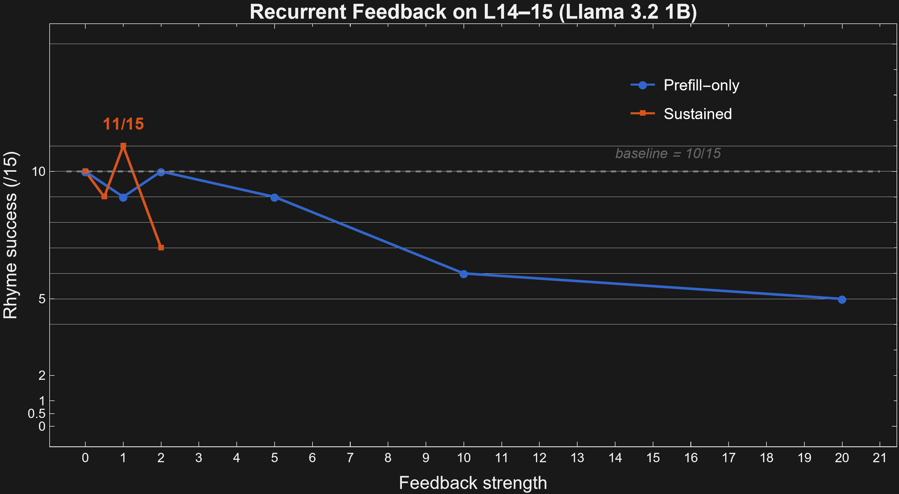
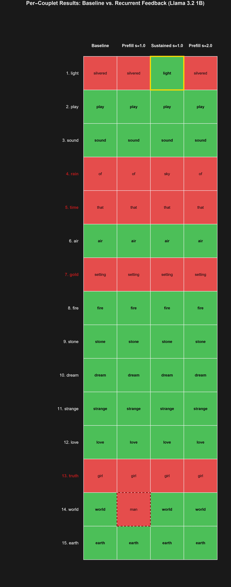

# Recurrent Feedback Experiments

*Anácrousis (ἀνάκρουσις) — "the upbeat before the first full bar";
here, the recurrent pulse that sustains the rhyme plan through generation.*

**Author:** Eric Jacopin

**Model:** Llama 3.2 1B (`meta-llama/Llama-3.2-1B`, 16 layers)

**Hardware:** RTX 5060 Ti 16 GB, CUDA

---

**Contents:**
[1. Overview](#1-overview) |
[2. Key results](#2-key-results) |
[3. Document map](#3-document-map) |
[4. File inventory](#4-file-inventory) |
[5. Reproduction](#5-reproduction) |
[6. Acknowledgments](#6-acknowledgments)

---

## 1. Overview

The [melomētis branch](../planning-in-poems/README.md) replicated Anthropic's
Figure 13: suppress + inject CLT steering at the planning site redirects the
line ending, with a 10-million-fold spike localizing the effect at a single
token. The [trágos branch](../planning-circuit-hunt/README.md) extended the
investigation to Llama 3.2 1B, identifying a commitment circuit (L14-15) that
sustains the rhyme signal to the output — a circuit analogous to L22-25 in
Gemma 2 2B.

A structural parallel emerged: both the transformer's planning mechanism and
the Deep Repeating ConvLSTM (DRC) trained on Sokoban [Taufeeque et al., 2024,
2025] implement the same three-phase algorithm — Initialize, Extend & Refine,
Commit — through different mechanisms. The Figure 13 replication provides the
structural bridge connecting both findings (see
[figure13-bridge-drc-to-transformers.md](figure13-bridge-drc-to-transformers.md)).

A natural question follows: if the DRC refines its plan through extra recurrent
ticks at every timestep, can the transformer benefit from a similar mechanism?
This branch tests two variants:

1. **Prefill-only recurrence** (Phase 1): re-run Llama's commitment layers
   (L14-15) during prefill with optional feedback injection. Tests whether a
   single extra pass can improve the planning representation.

2. **Sustained recurrence** (Phase 2): apply the recurrent block at every
   autoregressive generation step — the transformer analog of the DRC's
   per-tick computation. Tests whether persistent directional pressure during
   generation can convert baseline failures.

---

## 2. Key results

**28 conditions x 15 couplets = 420 measurements.**

| Phase | Headline condition | Rhymes | vs. baseline | Key finding |
|-------|-------------------|--------|-------------|-------------|
| -- | Baseline (no intervention) | 10/15 | -- | Reference |
| 1 | Double pass, no feedback (all ranges) | 0--4/15 | Destructive | Pure recurrence without guidance destroys rhyming |
| 1 | unembed_14-15_s=2.0 (prefill only) | 10/15 | Tied | 29x P(rhyme family) increase, but trajectory unchanged |
| **2** | **sustained_14-15_s=1.0** | **11/15** | **+1** | **1 failure converted, 0 regressions, 0 prefill-only condition achieves this** |
| 2 | sustained_14-15_s=2.0 | 7/15 | -3 | Inverted-U: too much pressure collapses generation |



The sustained s=1.0 result is a strict superset of the baseline: all 10
baseline successes preserved, plus couplet 1 ("light") converted from
"silvered" to "light" (exact target word). No prefill-only condition at any
strength or loop range achieves this conversion.



Four couplets resist every quality-preserving intervention: 4 (rain), 5 (time),
7 (gold), 13 (truth). These represent a qualitatively different failure mode —
absent plan initialization rather than plan dissipation — that cannot be
addressed by additional computation or directional pressure alone.

---

## 3. Document map

| Document | Content |
|----------|---------|
| [figure13-bridge-drc-to-transformers.md](figure13-bridge-drc-to-transformers.md) | The full theoretical framework: DRC-to-transformer structural correspondence, both phases of experimental results, per-couplet analysis, assessment, and conclusions |

---

## 4. File inventory

### Source code (modified)

| File | Lines added | Change |
|------|:-----------:|--------|
| `src/forward_llama.rs` | +445 | `forward_with_recurrent_pass`, `forward_with_kv_cache_recurrent`, `generate_with_recurrent_pass` |
| `src/intervention.rs` | +96 | `RecurrentPassSpec`, `RecurrentFeedbackEntry` |
| `src/model.rs` | +77 | `generate_with_recurrent_pass` trait method + `PlipLlama` dispatch |
| `src/lib.rs` | +2 | Re-exports for `RecurrentPassSpec`, `RecurrentFeedbackEntry` |
| `Cargo.toml` | +8 | `cmu_pron` dependency (CMU Pronouncing Dictionary for rhyme family lookup) |

### Examples

| Example | Role |
|---------|------|
| `recurrent_block_rhyme` (639 lines) | Full experiment: 28 conditions x 15 couplets, prefill logit analysis + generation, JSON output |

### Output files

| File | Content |
|------|---------|
| `outputs/recurrent_block_rhyme.json` | 420 measurements (28 conditions x 15 couplets), 144 KB |

### Figures

| File | Content |
|------|---------|
| `figures/recurrent_feedback_strength_curve.png` | Strength-response curve: prefill-only vs. sustained on L14-15 |
| `figures/recurrent_feedback_couplet_grid.png` | Per-couplet success grid (baseline, prefill s=1.0, sustained s=1.0, prefill s=2.0) |

### Scripts

| File | Content |
|------|---------|
| `scripts/recurrent_feedback_figures.wl` | Mathematica data + plotting code for figures |

---

## 5. Reproduction

```bash
cargo run --release --example recurrent_block_rhyme
```

Results are written to `outputs/recurrent_block_rhyme.json`.

**Runtime:** ~15-20 minutes on an RTX 5060 Ti 16 GB. The sustained conditions
add ~50% overhead per couplet because each generation step runs the recurrent
block (two passes through L14-15 with KV-cache trimming).

**Requirements:**
- Llama 3.2 1B weights cached locally from HuggingFace
  (`meta-llama/Llama-3.2-1B`)
- CUDA-capable GPU with >= 4 GB VRAM (the model is ~4 GB in BF16)

---

## See also

- **[Planning in Poems](../planning-in-poems/README.md)** (melomētis) — the
  original Gemma 2 2B Figure 13 replication that established planning-site
  localization in an open model.

- **[Planning Circuit Hunt](../planning-circuit-hunt/README.md)** (trágos) —
  the cross-model investigation (Gemma + Llama) that identified the
  commitment circuit and the search/selection/commitment three-stage model.

---

## 6. Acknowledgments

- **Anthropic** -- the original "Planning in Poems" finding
  ([Biology of a Large Language Model](https://transformer-circuits.pub/2025/attribution-graphs/biology.html#dives-poems),
  Lindsey et al., 2025)
- **Taufeeque et al.** -- the DRC planning mechanism in Sokoban
  ([arXiv:2407.15421](https://arxiv.org/abs/2407.15421), 2024;
  [arXiv:2506.10138](https://arxiv.org/abs/2506.10138), 2025)
- **mntss** -- the [524K CLT](https://huggingface.co/mntss/clt-llama-3.2-1b-524k)
  for Llama 3.2 1B
- **Meta** -- the [Llama 3.2 1B](https://huggingface.co/meta-llama/Llama-3.2-1B) model
- **HuggingFace [candle](https://github.com/huggingface/candle)** -- the Rust ML framework
